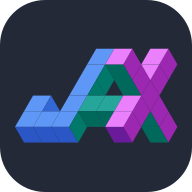
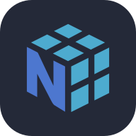
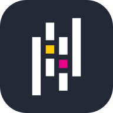
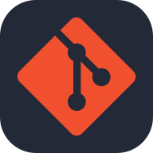

  
# 👋 Hi, I'm <strong>Gokul Raju Govinda Raju!</strong>

<picture>
  <source media="(prefers-color-scheme: dark)" srcset="https://readme-typing-svg.demolab.com?font=Fira+Code&weight=500&size=22&pause=900&color=9AE6B4&width=780&center=true&vCenter=true&lines=Machine+Learning+%E2%80%A2+Computer+Vision+%E2%80%A2+Reinforcement+Learning;Neuromorphic+Vision+%E2%80%A2+Sequence+Modeling+%E2%80%A2+Generative+AI;Open+to+collaboration+%26+roles">
  
</picture>

---

## 🚀 About Me
- 🎓 **MSc, Robotics, Systems and Control @ ETH Zurich (2022–2025)**   
- 🔬 **Research**: State-space models for efficient RL in quadrotors; event-camera optical flow; diffusion models (LoRA) for product imagery.  
- 🌐 **Portfolio**: <a href="https://bjfpgzoc.github.io" target="_blank">bjfpgzoc.github.io</a>

---

## 💻 Tech Stack

  
  
  
  
  
  

  
  
  
  
  
  

**Programming Languages**: Python, MATLAB  
**ML Frameworks**: Pytorch, JAX  
**Technical**: Machine Learning, Computer Vision, Reinforcement Learning, Neuromorphic Vision, State-Space Models, Diffusion, LLMs  
**Libraries**: NumPy, SciPy, scikit-learn, OpenCV, Matplotlib, Pandas, Hugging Face

---

## 🔬 Research & Publications
**Perturbed State Space Feature Encoders for Optical Flow with Event Cameras**  
  *CVPR Workshops 2025 (Nashville)*  
  Gokul Raju Govinda Raju, Nikola Zubić, Marco Cannici, Davide Scaramuzza  
  [[arXiv]](https://doi.org/10.48550/arXiv.2504.10669)

### Thesis Work
- **Master’s Thesis — State-Space Models for Efficient Reinforcement Learning in Quadrotors** (UZH RPG, 2024)  
  - First SSM-based RL framework for autonomous drone racing (state + vision)  
  - Custom PPO (JAX) for Flightmare Simulator; **8–10% faster lap time** and **~50% faster inference** vs baselines  
  - Report: <a href="https://github.com/BjfpgZOC/ETH-Master-Thesis" target="_blank">ETH-Master-Thesis</a>
- **Semester Thesis — Pushing the Limits of Optical Flow Estimation for Event Cameras** (UZH RPG, 2023)  
  - First multi-event learning optical-flow framework; SOTA on DSEC-Flow & MVSEC benchmarks 
  - Report: <a href="https://github.com/BjfpgZOC/ETH-Semester-Thesis" target="_blank">ETH-Semester-Thesis</a>

---

## 🤝 Let’s collaborate
- Open to **ML / CV / RL / Robotics** engineer roles and internships.